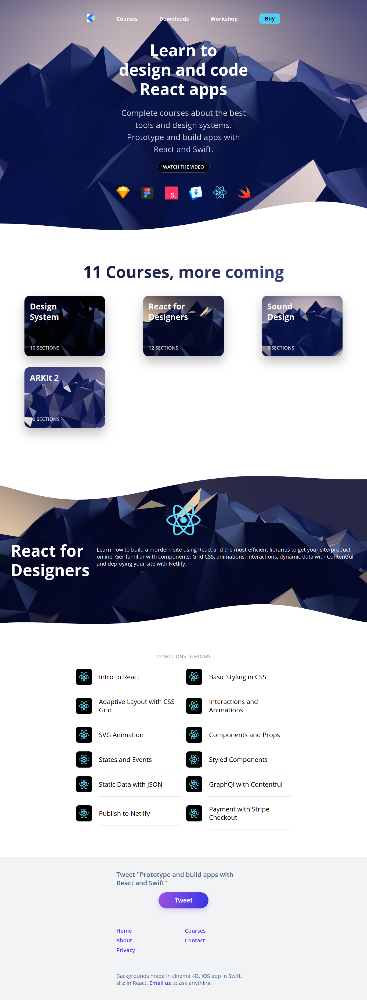

## Preview

<p align="center">
    
</p>

## Install

Make sure that you have the Gatsby CLI program installed:

```sh
npm install --global gatsby-cli
```

And run from your CLI:

```sh
gatsby new gatsby-example-site
```

Then you can run it by:

```sh
cd gatsby-example-site
gatsby develop
```

## Deploy

[](https://modest-dijkstra-f9f00d.netlify.com/)
